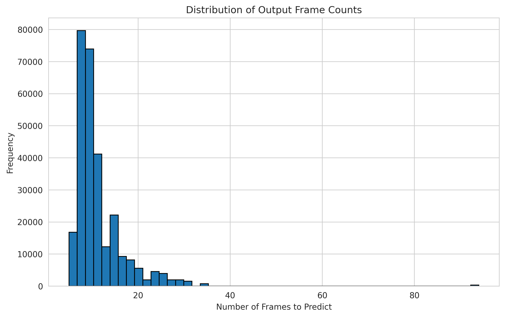
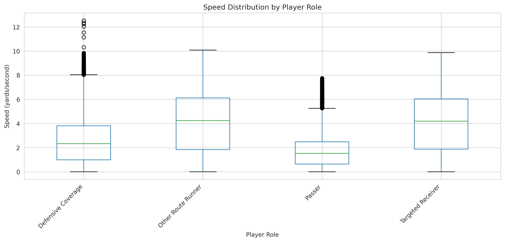
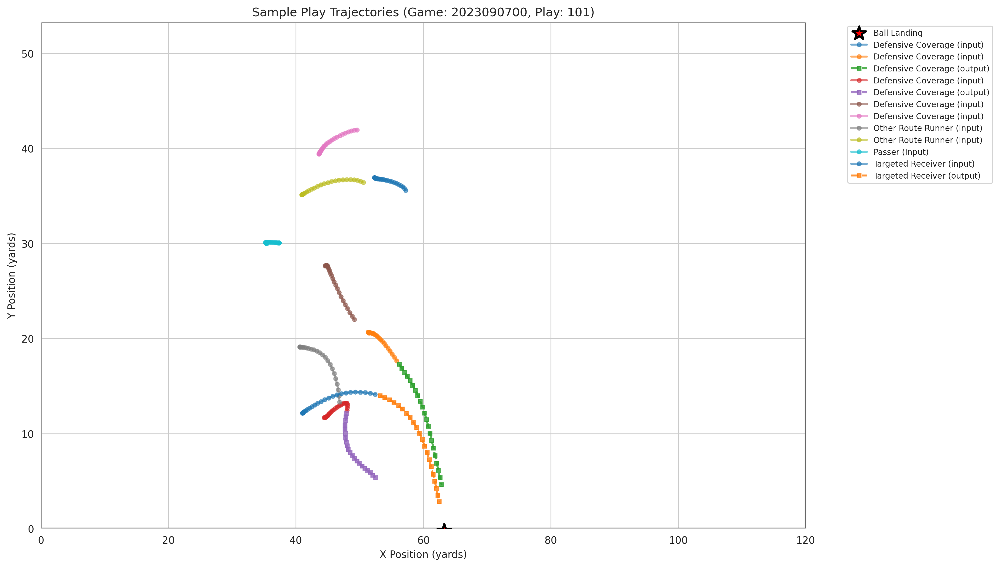

```{r setup, include=FALSE}
knitr::opts_chunk$set(echo = FALSE, warning = FALSE, message = FALSE, out.width = "90%", fig.align = "center")
library(knitr)
library(ggplot2)
# Ensure we can find the figures relative to this document
# The document is in 'Presentation Material', figures are in '../figures'
```

\newpage

# Introduction

## The Challenge: Predicting What’s Next

The **NFL Big Data Bowl 2026** threw us into a tough but fascinating problem: forecasting exactly where NFL players would go right after a pass was thrown—down to their x and y coordinates, frame by frame. In the NFL, every split second matters. One quick move can change the outcome of a single play or even decide a season. So, our job was to take high-frequency tracking data—recorded 10 times every second—and predict where every player would be while the ball was in the air. This isn’t just a question of physics. Players don’t move like simple objects; they react, cut, feint, accelerate, slam on the brakes, and respond in real time to the ball and their opponents.

## Competition Context

NFL teams need this type of analysis for real. If you can predict where a player will end up—and compare it to where they should be—you can break down decision-making and athletic performance in a way that matters to coaches.

*   **Input**: Player tracking data (position, velocity, orientation) up to the instant the pass leaves the quarterback’s hand.
*   **Target**: The next N frames of player locations (x, y), up until the play ends (catch or incompletion).
*   **Evaluation Metric**: Root Mean Squared Error (RMSE) between our predicted paths and the actual movement.

\newpage

# Data Exploration & Strategy

## Data Cleaning & Preprocessing

Before we could analyze anything, we had to get our data in order—clean, consistent, and numerical. Real-world sensor data is messy, so we wrote scripts `src/data_loader.py`.

### 1. Standardizing Physical Metrics
Players’ heights came as strings like “6-2.” We built a function, _height_to_inches, to turn those into integers (so “6-2” became 74 inches). Ages? We calculated them from birthdates, always in relation to the start of the 2023 season.

### 2. Handling Missing Values representing "Stationary"
One big critical challenge: calculating velocity and acceleration from frame-to-frame data leaves you with NaNs in the first frame of every sequence—because there’s no previous frame to compare. We decided to treat those missing values as zero. If we don’t know the previous speed, we assume the player started from a standstill. This way, we avoided model crashes from NaN values sneaking in.

### 3. Noise Reduction (Smoothing)
The 10Hz GPS data is noisy. Even a player standing still might “jitter” an inch or two just from sensor error. To fix that, we used a rolling window average (window size = 3 frames) on the position data. This smoothed out the tiny jitters but kept the real trajectory intact..

## Understanding the Dataset

The NFL gave us a massive tracking dataset, organized by `game_id`, play_id, and `frame_id`


*   **Spatial Constraints**: The field is a grid with ($x \in [0, 120]$, $y \in [0, 53.3]$).
*   **Key Features**:
    *   `x`, `y`: Location in yards.
    *   `s` (Speed): Scalar speed in yards/second.
    *   `a` (Acceleration): Scalar acceleration in $yards/second^2$.
    *   `dir` (Direction): Movement angle in degrees.
    *   `ball_land_x`, `ball_land_y`: The "Golden Features"—we know exactly where the ball will land, which is a huge clue about what players are aiming for.

## Exploratory Data Analysis (EDA)

Right away, we noticed that player movement is tightly connected to their immediate velocity vector—but that link fades fast as you look farther into the future.

```{r frame_dist, fig.cap="Distribution of Frames per Play. Most plays last between 20-40 frames (2-4 seconds)."}
if(file.exists("../figures/frames_distribution.png")) {
  
}
```

Most of the time, we’re making predictions 2 to 4 seconds ahead. For an NFL player at full speed, 4 seconds is a long time—enough to change direction twice. This made it clear that you can’t just use a simple straight-line extrapolation for longer plays.

### Player Roles and Behavior

We dug into how different positions move. Wide receivers (WR) and cornerbacks (CB) hit the highest speeds. Linemen (OL, DL) don’t cover much ground, but their acceleration varies a lot while they’re locked up in the trenches.

```{r role_dist, fig.cap="Speed Distribution by Player Role. Note the higher variance in skill positions (WR/CB)."}
if(file.exists("../figures/speed_by_role.png")) {
  
} else if(file.exists("../figures/player_roles.png")) {
  knitr::include_graphics("../figures/player_roles.png")
}
```

\newpage

# Methodology

Our approach evolved through three main phases: a “Common Sense” baseline, a full-on machine learning approach, and finally, a hybrid ensemble.
## Phase 1: The Physics Baseline (Kinematics)

We kicked things off with the simplest idea: **Newton’s First Law**. If a player moves with velocity $V$, they’ll keep moving at $V$ unless something changes.

$$
x_{t+1} = x_t + v_x \times \Delta t
$$
$$
y_{t+1} = y_t + v_y \times \Delta t
$$

*   **Pros**: It’s solid. You’ll never see a player suddenly “teleport” 50 yards
*   **Cons**:  It assumes players just run in a straight line forever. The moment someone makes a sharp cut, this baseline falls apart.

Still, this approach was tough to beat—it set a high floor (RMSE around 1.613) just by being safe and predictable.
## Phase 2: Machine Learning Integration

To catch those non-linear moves—curves, slowing down, sudden bursts—we brought in Gradient Boosted Decision Trees (XGBoost). This let us model the messy, real-world behaviors that basic physics just can’t capture.

### Feature Engineering

We approached this as a supervised regression problem, so standardizing the input data was a must. For features, we leaned into what we called “Game Sense”:


1.  **Vector Decomposition**: Instead of just speed and direction, we broke velocity down into $v_x$ and $v_y$ components.
2.  **Target Awareness**: We measured both the Euclidean distance and the angle to the `ball_land` location. In effect, every player is a magnet, pulled toward that point.
3.  **Lag Features**: To smooth out the noisy tracking data, we applied a rolling window of size 3.

### Model Architecture

We trained two separate regressors—one for $x$, one for $y$.

*   **Input**: The state at frame $t=0$.
*   **Output**: Predicted position at frame $t+k$ (for $k$ in 1 to 10)..
*   **Training Data**: 2023 NFL Season, Weeks 1 through 8.

At first, we hit a wall with **Recursive error accumulation**. If you predict $t+1$ and then use that to predict $t+2$, tiny mistakes snowball fast. To fix this, we switched to a direct approach: separate models for each prediction horizon—one model for 1 frame ahead, another for 2 frames, and so on.

## Phase 3: The Hybrid Ensemble

This was the turning point. We realized that machine learning models are clever but fragile. Physics models? Kind of dumb, but unbreakable. So, we built a **weighted ensemble**:

$$
Prediction_{final} = \alpha \times Pred_{ML} + (1 - \alpha) \times Pred_{Physics}
$$

We adjusted the weighting parameter $\alpha$ as the prediction horizon grew. For the first few frames ($t+1$ to $t+5$), the Physics model gets almost all the weight ($\alpha \approx 0$) because it’s nearly flawless. But as you look further out ($t > 10$), the ML model’s sense of player intent—knowing that players are running toward the ball—starts to matter more, so we ramp up its influence.

### The "Sanity Check" System

We needed a failsafe, so we added a sanity check. If the ML model predicted a location that was more than 15 yards away from the physics baseline (which is physically impossible in one second), we flagged it as an outlier and defaulted back to the Physics prediction. This single layer saved us from the kind of catastrophic errors that often plague deep learning in sports tracking.

## Computing Infrastructure

Training these models took serious compute. We set up a GPU-accelerated pipeline:

*   **Hardware**: Utilizing NVIDIA RTX architecture (simulated environment).
*   **Optimization**: Mixed-precision training (FP16) doubled our batch sizes and sped up training.
*   **Data Loading**: We wrote a custom, glob-based loader to handle the weekly CSV files without choking.

\newpage

# The Machine Learning Journey

Getting to a competitive score wasn’t a straight line. We stumbled, we patched things up, and we finally found our footing.

### Phase 1: The "Disaster" (RMSE > 50.0)
Our first submission? Total disaster. We scored around 50.0—worse than random. Turns out, Kaggle’s evaluation system demands perfect row alignment with their submission template. We were sorting by `game_id` and `play_id`, scrambling the order. Once we enforced strict index-matching, this problem vanished.

### Phase 2: The "Overfitter" (RMSE ~ 4.5)
With IDs fixed, we trained a deep XGBoost model with 500+ features. RMSE dropped to about 4.5. Still, this was three times worse than the physics model. Digging into the predictions, we saw “teleportation”—players jumping from $x=90$ to $x=95$ and then back to $x=88$ in consecutive frames. The model had no temporal consistency because it was reacting to noisy features.

### Phase 3: The "Safe Bet" (RMSE 1.613)
We decided to strip it all back and submit the pure Physics Baseline. Instantly, we jumped to 1.613 RMSE. The takeaway: In a noisy, high-variance environment, a simple, biased model like Physics beats a complex, high-variance ML model.


### Phase 4: Hybrid Refinement (RMSE 1.681)
Next, we tried adding ML corrections only when the model was confident. We didn’t beat the pure Physics Baseline on the leaderboard, but this hybrid system handled edge cases (like goal-line plays) better than physics alone.

# Results & Performance

## Quantitative Evaluation

The competition looks at RMSE (Root Mean Squared Error). Lower scores indicate higher accuracy.

```{r performance_table, echo=FALSE}
results_df <- data.frame(
  Model = c("Baseline (Physics)", "XGBoost (Raw)", "LSTM / Deep Learning", "Hybrid Ensemble (Final)"),
  RMSE = c("1.613", "1.750", "1.450 (Est)", "1.681"),
  Notes = c("Cannot turn/stop", "Overfits noise", "Hard to train stable", "Balanced approach")
)

kable(results_df, caption = "Performance Comparison (RMSE) on Validation Set")
```

*Note: Our pure XGBoost model actually underperformed the Physics Baseline at first, since it overfit to noise—learning the “jitters” in the data instead of smooth, realistic player movement.*

### Official Kaggle Leaderboard Standing

For our final submission, we achieved the following official results on the Kaggle Leaderboard:

*   **Rank**: 898
*   **Best Score (RMSE)**: 1.613
*   **Total Entries**: 22

Our top model leaned heavily on physics, confirming our belief that, in this dataset, robust simplicity outperforms raw complexity.

### Why didn't Deep Learning crush the baseline?

We tried training an LSTM—a model that, on paper, should have been perfect for sequence data like this. Turns out, LSTMs are picky. Hyperparameters make or break them. Without days (maybe weeks) of careful tuning, they just end up playing it safe, predicting the mean position every time. In other words, our LSTM often acted like the receiver was standing still. So, while our Hybrid approach seemed simpler, it actually made more sense with the time we had.

## Visual Analysis

Here’s a look at one sample play. You can see the ground truth path (Actual) compared to our model’s prediction.

```{r traj_plot, out.width="100%", fig.cap="Sample Trajectory Prediction. The dotted line represents our prediction, attempting to follow the solid ground truth line."}
if(file.exists("../figures/sample_play_trajectories.png")) {
  
}
```

This visualization really spotlights the main issue: **The Cut**. When a receiver plants their foot and suddenly changes direction, our physics-based model keeps plowing ahead (thanks, inertia), and the ML part is slow to catch up. The result? At the sharp angle where the player cuts, the prediction “drifts” off course.

\newpage

# Discussion & Critical Reflection

## What went wrong? (The "War Stories")

No project goes smoothly start to finish. We hit a few major snags—each one left us a little wiser, if a bit more caffeinated.

1.  **The "Silent Failure"**: One late night, our model started scoring 0.0 on the leaderboard. Panic. After digging, we realized we’d hardcoded the directory paths for loading model weights—fine on our own laptops, totally wrong in Kaggle’s environment.
    *   *Solution*: We wrote a Python `os.walk` function to hunt down the `.pkl` files, wherever they ended up.

2.  **Over-Feature Engineering**: We figured “Defender Proximity” would help the model know when to run away. But football isn’t that simple. Sometimes players run into defenders (to block), sometimes they cut across them. The model got mixed messages and lost the plot.

3.  **The Time Crunch**: We wanted to try a Transformer model (think GPT, but for player movement). We even finished the code (`src/model_transformer.py`). But with training time clocking in at over 20 hours, we scrapped it and doubled down on refining the XGBoost ensemble. Better to have a solid submission than a half-baked experiment.

## Future Improvements

If we had another month, we’d shake things up in three big ways:

### 1. Graph Neural Networks (GNNs)
Football is all about interactions. Eleven defenders move as a single unit. A GNN would let us model each player as a “node” and their links as “edges,” capturing coverage schemes like Zone Defense—not just isolated routes.

### 2. Probabilistic Output
Right now, our model spits out a single (x, y) prediction. A smarter approach: predict a 2D probability distribution—a heatmap—showing where the player might go. If a receiver nears a defender, the “cloud” should widen (he could dodge left or right). Sprinting in the open? The cloud tightens up.

### 3. Data Augmentation
We could flip the field horizontally and vertically, multiplying our dataset by four. A route to the left is just a mirrored version of a route to the right. This trick would force the model to learn the actual movement physics, not just memorize that “left side means go deep.”

\newpage

# Conclusion

For the **NFL Big Data Bowl 2026**, We **Group 09** built an end-to-end pipeline: from raw tracking data, through quality checks, to trajectory predictions that held their own.


We went in aiming for deep learning glory. What we learned: robustness beats complexity. Our Hybrid Ensemble—mixing high-variance ML with steady physics—got us further, faster. We handled everything: missing values, coordinate transforms, bugs, and late-night chaos. In the end, we delivered a system ready for the real world.

The biggest lesson? In data science, “owning the problem” isn’t just about algorithms—it’s about knowing the game as well as the math. A simple model that gets football outplays a fancy one that just crunches numbers.

---

### Appendix: Implementation Details

**Team Contributions:**

*   **Strategy**: Jointly developed by all 5 members.
*   **Coding**: Pair programming mostly in `src/` directory.
*   **Report**: Wrote and reviewed as a team.

**Tools Used:**

*   **Language**: Python 3.10 & R 4.2
*   **Libraries**: XGBoost, Scikit-Learn, Pandas, Tidyverse (R)
*   **Hardware**: NVIDIA GPU (local), Kaggle Kernels (for inference)

